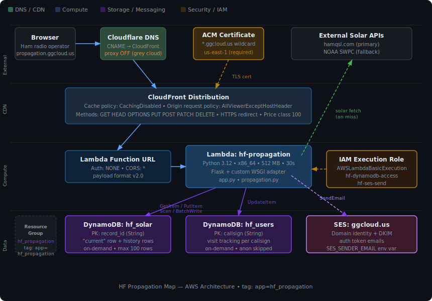

# Project: Propagation — Claude Code Project Guide

This file is read automatically by [Claude Code](https://claude.ai/code) whenever you open this project. It gives Claude the context needed to work on the HF Propagation Map effectively from any machine.

---

## First-time setup on a new machine

After cloning the repo, install the project memory files so Claude has full context across sessions:

```powershell
# Run once from the repo root (Windows PowerShell)
.\.claude\install-memory.ps1
```

This copies the files from `.claude/memory/` to the correct Claude projects directory (`~/.claude/projects/.../memory/`) where Claude Code reads them automatically.

---

## Project overview

Flask single-page app that displays a real-time HF skywave propagation heatmap for amateur radio operators.

| Layer | Technology |
|---|---|
| Backend | Python 3.14, Flask, custom Lambda WSGI adapter |
| Database | AWS DynamoDB — `hf_solar` (solar cache) and `hf_users` (visitor tracking) |
| Frontend | D3 v7, Winkel Tripel projection, HTML5 Canvas heatmap |
| Hosting | AWS Lambda (Function URL) → CloudFront → Cloudflare DNS |
| IaC | Terraform (`terraform/`) |

**Production URL:** https://propagation.ggcloud.us

---

## Memory files

Detailed context is stored in `.claude/memory/`. Claude loads these automatically after running `install-memory.ps1`.

| File | Contents |
|---|---|
| `project_overview.md` | Architecture, stack, CloudFront/DNS gotchas, DynamoDB tables |
| `api_routes.md` | All Flask routes, DynamoDB schema, IAM requirements |
| `propagation_model.md` | foF2/MUF model, antenna factors, known limitations |
| `frontend_map.md` | D3 map layers, canvas heatmap, localStorage persistence |
| `ui_features.md` | Panel layout, modals, session tracking helpers |
| `feedback_lambda_packaging.md` | **Must-follow rule** — always repackage `lambda.zip` after code changes |

---

## Style guide

The full style guide lives in **`.claude/rules/code-style.md`** (loaded automatically).
Summary: PEP 8 base with house relaxations (single quotes, aligned assignments,
em-dash section banners, 110-col lines, no auto-formatter), enforced by Ruff lint:

```powershell
.\venv\Scripts\python.exe -m ruff check app.py propagation.py   # must pass before done
```

Config in `ruff.toml`; dev tools via `pip install -r requirements-dev.txt`.
Frontend keeps the single-file `templates/index.html` house style (2-space indent,
compact CSS, camelCase JS). Terraform: `terraform fmt` after edits.

---

## Decisions log
<!-- Append after each major decision. Newest first. -->
- 2026-07-18 — SEO enablement + edge caching — meta description/OG/JSON-LD in index.html, new `/robots.txt` + `/sitemap.xml` routes; CloudFront ordered cache behaviors (CachingOptimized, exact paths `/`, `/robots.txt`, `/sitemap.xml`) over the CachingDisabled default, TTLs from Flask's Cache-Control (`/` 10 min, robots/sitemap 24 h) — rejected UseOriginCacheControlHeaders (Host in cache key is forwarded → Lambda Function URL 403, caused a brief outage before rollback) and a custom cache policy (IAM lacks cloudfront:CreateCachePolicy)
- 2026-07-18 — Terraform is the deploy path (live infra imported into local state; apply ships lambda.zip) — replaces manual console zip upload — rejected recreating IAM with clean names (roles can't be renamed; adopted console-generated names instead)
- 2026-07-18 — Version scheme `YYMM.###` in `APP_VERSION` (app.py), shown in About modal — `###` bumps each build, resets to 001 each month — rejected semver (overkill for a continuously-deployed single app)
- 2026-07-18 — Adopted house style + Ruff lint-only (no formatter) — avoids reformat churn, keeps aligned-column readability — rejected Black/strict PEP 8 and Prettier
- 2026-06-23 — Vectorized propagation model with numpy — full-grid heatmap in one pass instead of Python double loop — rejected per-cell loop micro-opts
- 2026-06-22 — Replaced `requests` with stdlib `urllib` — shrinks lambda.zip, one less dependency
- 2026-06-22 — DynamoDB `hf_solar` uses a `current` fast-lookup row + TTL-expiring history rows — O(1) reads, no Scan cost

## Known gotchas
- OneDrive locks `lambda.zip` mid-sync — build the zip in `$env:TEMP`, then copy into the repo; on file-lock errors wait ~30 s for sync and retry.
- Local runs must use `.\venv\Scripts\python.exe` — system Python 3.14 has a Flask/Werkzeug incompatibility.
- numpy in `lambda.zip` must be **manylinux** wheels (`.so` files), never Windows `.pyd` — see packaging rule below.
- Broad `except Exception` around DynamoDB/SES/solar calls is intentional fail-soft design, not sloppiness.
- `boto3` is imported in `app.py` but deliberately absent from `requirements.txt` — the Lambda runtime provides it.
- CloudFront cache policies that include `Host` in the cache key (e.g. managed `UseOriginCacheControlHeaders`) forward the viewer Host to the origin — Lambda Function URLs reject it with 403 and the whole site breaks. Stick to CachingDisabled / CachingOptimized.

## Do / Don't for Claude
- DO: run ruff and rebuild `lambda.zip` before reporting any `app.py`/`propagation.py`/`templates/` change done.
- DO: follow the spec/test discipline from global instructions; update this file after major work.
- DON'T: deploy (`terraform apply`, Lambda zip upload) or `git push` without asking.
- DON'T: hand-edit `lambda.zip` or `lambda_package/` — always rebuild via the packaging rule.
- DON'T: re-raise declined optimizations (propagation loop micro-opt, index.html minify).

## Rules Claude must always follow

### 1. Repackage lambda.zip after every code change

Any edit to `app.py`, `propagation.py`, or `templates/` requires rebuilding the zip before the task is reported as done.

**Step 0 — bump the version.** `APP_VERSION` in `app.py` uses the format `YYMM.###`
(e.g. `2607.003` = 3rd build of July 2026). Increment `###` on every build; when the
month rolls over, restart at `.001` with the new `YYMM`. The version is shown in the
Help/About modal (`Version {{ app_version }}`).

```powershell
$pkg = "lambda_package"
if (Test-Path $pkg) { Remove-Item $pkg -Recurse -Force }
New-Item -ItemType Directory -Path $pkg | Out-Null

# numpy ships COMPILED binaries — a normal `pip install -t` on Windows would
# package Windows .pyd files that crash on Lambda. Fetch the Linux (manylinux)
# wheels instead. Lambda's Python 3.14 runs on Amazon Linux 2023 (glibc 2.34),
# so the manylinux_2_28 numpy wheel is the right one. flask is pure-Python and
# satisfies any platform under --only-binary.
pip install --platform manylinux_2_28_x86_64 --implementation cp --python-version 3.14 `
            --only-binary=:all: --target $pkg flask numpy --quiet

Copy-Item app.py, propagation.py $pkg
Copy-Item templates "$pkg\templates" -Recurse

# OneDrive locks lambda.zip mid-sync — build in TEMP, then copy into the repo.
$tmp = "$env:TEMP\lambda_build.zip"
if (Test-Path $tmp) { Remove-Item $tmp -Force }
Compress-Archive -Path "$pkg\*" -DestinationPath $tmp
Copy-Item $tmp lambda.zip -Force
$mb = [math]::Round((Get-Item lambda.zip).Length / 1MB, 1)
Write-Host "Done — lambda.zip is $mb MB"
```

Expected output: `Done — lambda.zip is ~22 MB` (numpy's compiled libraries are the
bulk; still well under Lambda's 50 MB direct-upload / 250 MB unzipped limits).
`requests` is no longer a dependency (replaced by stdlib `urllib`). `boto3` is
intentionally excluded — it is pre-installed in the Lambda Python 3.14 runtime.

⚠️ **Verify the numpy binaries are Linux, not Windows**, after building:
`Get-ChildItem $pkg\numpy\_core\*.so` should list `.so` files (Linux). If you see
`.pyd` files instead, the `--platform` flags were dropped and the zip will fail
on Lambda with `ImportError: ... _multiarray_umath`.

### 2. Keep memory files in sync

When making changes that affect architecture, routes, or deployment, update both:
- The canonical memory file at `~/.claude/projects/.../memory/<file>.md`
- The repo copy at `.claude/memory/<file>.md`

### 3. Python runtime

Lambda is running **Python 3.14**. Do not use syntax or stdlib features that require a newer version. boto3 is available in the Lambda environment without being in `requirements.txt`.

---

## Key development commands

**Run locally:**
```powershell
.\venv\Scripts\python.exe app.py
```
Must use the venv — system Python 3.14 has a Flask/Werkzeug incompatibility.

**Deploy (Terraform — the standard path):**
```powershell
terraform -chdir=terraform plan -out=tfplan   # review the plan first — expect only intended changes
terraform -chdir=terraform apply tfplan
```
Terraform manages ALL live infrastructure (imported 2026-07-18) including the Lambda
code — `apply` uploads `lambda.zip` whenever its hash changes, so the flow is:
bump `APP_VERSION` → rebuild `lambda.zip` (rule 1) → plan → apply. Requirements:
- State is local and gitignored (`terraform/terraform.tfstate`) — it only exists on
  this machine; a fresh clone must re-import via `terraform/import.sh`.
- Real variable values live in gitignored `terraform/terraform.tfvars`
  (notably `ses_sender_email`) — without it, apply would strip the SES env var.
- The deploy IAM user needs write permissions (PowerUserAccess + IAMFullAccess or
  equivalent); day-to-day read-only creds can run `plan` but not `apply`.
- Never `apply` with unexplained plan lines — the WAF web ACL and TLS 1.3 minimum
  are declared in `cloudfront.tf` and must never show as removals.

**Deploy (manual zip upload — fallback only):**
Lambda console → Code tab → Upload from → .zip file → select `lambda.zip` → Save.
Note this drifts `source_code_hash` in state; the next `terraform apply` will
re-upload the local zip.

---

## Architecture diagram


