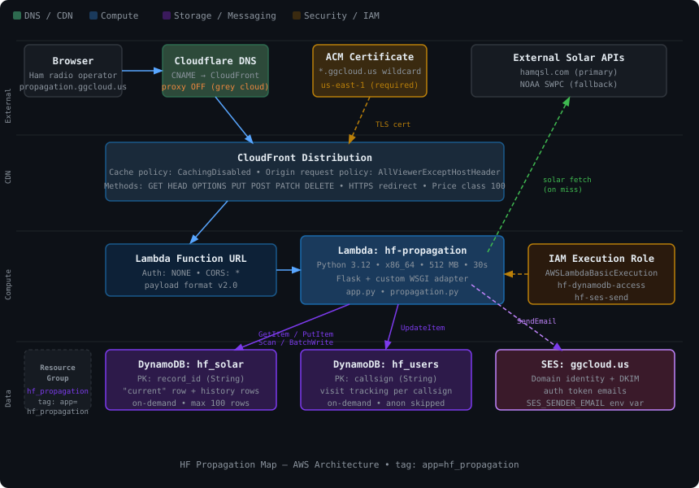

# HF Propagation Map

A real-time HF skywave propagation visualizer for amateur radio operators. Shows estimated band openness from your QTH to every point on the globe, driven by live solar indices and a physics-based ionospheric model.

**🌐 Live site: [propagation.ggcloud.us](https://propagation.ggcloud.us/)** — free to use, no sign-up required.

    

> **Working on this project?** This project is developed with [Claude Code](https://claude.ai/code). See [CLAUDE.md](CLAUDE.md) for setup instructions, including how to install the project memory files so Claude has full context on any machine.

---

## What It Does

- Fetches live solar data (SFI, K-index, A-index, sunspot number) from hamqsl.com with a NOAA fallback
- Caches solar data in DynamoDB — shared across all Lambda instances, auto-refreshed when over 2 hours old; keeps a 100-row history of every refresh
- Computes a global heatmap of propagation probability on the selected amateur band using a multi-hop F2 ionospheric model
- Renders the heatmap over a Winkel Tripel world map using D3.js and an HTML5 Canvas
- Supports three antenna models (vertical, dipole, hex beam) with height and orientation controls
- Lets you set your QTH by Maidenhead grid square, lat/lon, or US ZIP code
- Tracks visitors in DynamoDB by callsign (the stable cross-browser identity), IP, QTH, and access count
- Remembers your callsign and QTH across sessions via browser localStorage
- Search-engine ready — meta description, Open Graph tags, schema.org JSON-LD, `/robots.txt`, and `/sitemap.xml`; CloudFront edge-caches the root page and SEO endpoints so crawler traffic rarely invokes Lambda

---

## Project Structure

```
propagation/
├── app.py              # Flask app — routes, DynamoDB helpers, Lambda WSGI adapter
├── propagation.py      # Ionospheric model — foF2, MUF, antenna factors
├── templates/
│   └── index.html      # Single-page UI — D3 map, panel, all JavaScript
├── tools/validate/     # Dev-only: score the model against ionosondes and WSPR (see its README)
├── requirements.txt    # flask, numpy  (boto3 is pre-installed in the Lambda runtime)
├── LOCAL_INSTALL.md    # Running the app on your own machine
└── AWS_INSTALL.md      # Deploying to AWS Lambda with DynamoDB and CloudFront
```

---

## AWS Architecture



*Browser → Cloudflare DNS → CloudFront (TLS via ACM) → Lambda Function URL → Flask app → DynamoDB. SES handles auth token emails. All resources tagged `app=hf_propagation` and collected in an AWS Resource Group. CloudFront serves `/`, `/robots.txt`, and `/sitemap.xml` from its edge cache (driven by origin `Cache-Control` headers); every other route passes through uncached.*

---

## Installation

| Environment | Guide |
|---|---|
| Local / development | [LOCAL\_INSTALL.md](LOCAL_INSTALL.md) |
| AWS Lambda + CloudFront | [AWS\_INSTALL.md](AWS_INSTALL.md) |

---

## How to Use

### Callsign

On first visit a prompt asks for your amateur radio callsign. Enter it and click **Save** — it is stored in browser localStorage and sent to the server to create or update your visitor record. Click **Skip** to continue anonymously (no visitor record is created). You can re-open the callsign dialog at any time by clicking the callsign badge in the panel header.

### Setting your QTH

Click **Set QTH** at the bottom of the panel. Three entry methods:

| Method | Input | Example |
|---|---|---|
| **Grid** | Maidenhead locator | `EM38ab` |
| **Lat/Lon** | Decimal degrees | `39.8`, `-98.6` |
| **ZIP** | US ZIP code | `90210` |

Your callsign and QTH are saved in browser localStorage and restored automatically on every return visit — including when you return from a different browser or device after re-entering your callsign.

### Selecting a band

| Band | Frequency range |
|---|---|
| 80m | 3.5 – 4.0 MHz |
| 60m | 5.33 – 5.404 MHz |
| 40m | 7.0 – 7.3 MHz |
| 30m | 10.1 – 10.15 MHz |
| 20m | 14.0 – 14.35 MHz |
| 17m | 18.068 – 18.168 MHz |
| 15m | 21.0 – 21.45 MHz |
| 10m | 28.0 – 29.7 MHz |

### Reading the heatmap

| Color | Meaning |
|---|---|
| **Bright green** | Band wide open — prime operating range |
| **Yellow** | Good conditions |
| **Orange** | Marginal — noisy but workable |
| **Deep red** | Very low probability |
| **No color** | Band closed to that area |

The dashed circle marks the **skip zone** — too close for reliable skywave on the selected band.

Tick **Show greyline** (under the band selector) to overlay the twilight band in violet, the day/night terminator as a dashed line, and the sub-solar point as a yellow dot. The band is the same one the model's greyline boost uses (sun −12° to +3°). The setting is remembered in the browser.

### Antenna model

Check **Use antenna** to apply antenna pattern to the heatmap. Unchecked = baseline (no directional weighting).

| Antenna | Description |
|---|---|
| **Vertical** | Omnidirectional. λ/4 height optimal. |
| **Dipole** | Figure-8 pattern. Signal radiates broadside (90° to wire). |
| **Hex Beam** | ~60° beamwidth, ~6 dBd gain, ~19 dB F/B. 20m–10m only. |

### Solar indices panel

Displays Solar Flux Index, K-index, A-index, and Sunspot Number pulled from DynamoDB. The data is refreshed automatically when the cached value is more than 2 hours old. Hover each card for a plain-English explanation.

### Refresh button

The **Refresh Now** button is only shown when your callsign is **WB0Z**. It forces an immediate fetch from hamqsl.com regardless of cache age, writes a new row to the `hf_solar` history table (recording the callsign that triggered it), and updates the shared DynamoDB cache so all users see the new data.

---

## API Reference

### `GET /heatmap/<band>`

Returns heatmap data for the specified band.

**Query parameters:**

| Parameter | Default | Description |
|---|---|---|
| `lat` | 39.8 | Station latitude |
| `lon` | -98.6 | Station longitude |
| `antenna` | `vertical` | `vertical`, `dipole`, or `hex_beam` |
| `height_ft` | 30 | Antenna height in feet |
| `azimuth` | 0 | Hex beam pointing direction (degrees) |
| `dipole_orient` | 0 | Dipole wire azimuth (0 = N–S, 90 = E–W) |

**Response:** `[[lat, lon, strength], ...]` — strength is 0.0–1.0.

---

### `GET /solar`

Returns current solar indices. Reads from the DynamoDB `"current"` row; fetches fresh if over 2 hours old.

```json
{
  "SFI": 152.0,
  "K-index": 2.0,
  "A-index": 8.0,
  "Sunspot Number": 112.0,
  "source": "hamqsl.com",
  "last_update": 1750000000.0,
  "refreshed_by": "auto",
  "band_conditions": { "80m-40m_day": "Good", "20m-17m_day": "Fair" }
}
```

---

### `POST /solar/refresh`

Forces a fresh solar fetch regardless of cache age. Updates DynamoDB. Returns the same shape as `/GET /solar`.

Body: `{"callsign": "WB0Z"}` — stored in the history row as `refreshed_by`.

---

### `GET /zip/<zipcode>`

Geocodes a US ZIP code.

Response: `{"zipcode": "90210", "city": "Beverly Hills", "state": "CA", "lat": 34.09, "lon": -118.41}`

---

### `GET /robots.txt` · `GET /sitemap.xml`

Static SEO endpoints for search-engine crawlers. Both are sent with `Cache-Control: public, max-age=86400`, and the root page with `max-age=600`. CloudFront has dedicated cache behaviors (CachingOptimized) for exactly `/`, `/robots.txt`, and `/sitemap.xml` that honor those TTLs; every other route uses the CachingDisabled default and always reaches the app. robots.txt disallows the API prefixes (`/auth/`, `/admin/`, `/track/`, `/solar`, `/heatmap/`, `/zip/`).

---

### `POST /track/visit`

Body: `{"callsign": "W1AW"}`. Upserts the visitor row, increments `access_count`, updates `last_seen` and `ip_address`. No-op if callsign is empty (anonymous visitors are not tracked).

### `POST /track/callsign`

Body: `{"callsign": "W1AW", "session_id": "<uuid>"}`. Creates or updates the callsign row; stores the current browser `session_id` as a reference attribute.

### `POST /track/qth`

Body: `{"callsign": "W1AW", "lat": 39.8, "lon": -98.6, "method": "grid"}`. Updates QTH fields on the callsign row.

---

## DynamoDB Schema

### `hf_solar`

Two kinds of rows coexist in this table:

**Fast-lookup row** — always present, updated on every refresh:

| Attribute | Type | Description |
|---|---|---|
| `record_id` | String (PK) | Always `"current"` |
| `SFI` | Number | Solar flux index |
| `K-index` | Number | Geomagnetic K-index |
| `A-index` | Number | Geomagnetic A-index |
| `Sunspot Number` | Number | Daily sunspot count |
| `source` | String | `"hamqsl.com"` or `"NOAA"` |
| `band_conditions` | Map | Per-band condition strings |
| `timestamp` | String | ISO 8601 UTC write time |
| `timestamp_epoch` | Number | Unix epoch — used for TTL comparison |
| `refreshed_by` | String | Callsign or `"auto"` |

**History rows** — one new row per refresh, oldest deleted when count exceeds 100:

Same attributes as above, but `record_id` is a UTC timestamp string (e.g. `2026-06-22T14:30:00.123456Z`).

---

### `hf_users`

| Attribute | Type | Description |
|---|---|---|
| `callsign` | String (PK) | Amateur callsign — stable cross-browser identity |
| `session_id` | String | Most recent browser localStorage UUID |
| `ip_address` | String | Last seen IP address |
| `first_seen` | String | ISO 8601 UTC — set once, never overwritten |
| `last_seen` | String | ISO 8601 UTC — updated on every visit |
| `access_count` | Number | Atomically incremented on every page load |
| `qth_lat` | Number | Station latitude |
| `qth_lon` | Number | Station longitude |
| `qth_method` | String | `"grid"`, `"latlon"`, or `"zip"` |

---

## Propagation Model

Implemented in `propagation.py` with numpy-vectorized grid math; solar data is fetched with the stdlib `urllib`.

**Path geometry** — paths are split into equal hops of at most 3,500 km, with reflection points at the true great-circle hop midpoints.

**foF2** — daytime peak `2.85 + 0.052×SFI` (~8.1 MHz at SFI 100 at mid-latitudes), shaped by the solar zenith angle at each reflection point, so time of day, season and latitude all count. The layer starts ionizing when the sun is 20° below the horizon (at ~300 km it is sunlit before ground sunrise), lags the sun by 1.5 h, and fades after sunset with a 2 h time constant down to a night floor of 43% of the peak. Near the *geomagnetic* equator (weight `cos(maglat)^8`) the peak is up to 40% higher, the evening fade up to 4 h slower, and foF2 gets a further lift of up to 30% around 20:00 local time. This is the equatorial anomaly and its post-sunset "pre-reversal enhancement". Above 45° latitude the peak tapers down by up to 20% (trough/auroral zone). The equatorial terms were re-fitted on 29 ionosondes: tropical RMSE 2.34 → 1.82 MHz, and evening bias −2.1 → +0.2 MHz.

**Calibration and validation (Sep 2026)** — the foF2 constants were fitted to 16,200 GIRO ionosonde soundings (12 stations, one week, SFI 101–121) via [KC2G's API](https://prop.kc2g.com/stations/): mid-latitude RMSE 1.26 → 0.83 MHz with no time-of-day bias, tropics 3.11 → 1.70 MHz, MUF(3000) bias +0.1 MHz. The whole map was then scored against a week of 20m WSPR reception from Southern California (106,000 receiver-hours from [wspr.live](https://wspr.live)): ranking AUC 0.80 → 0.83, and heard paths shown dark 16% → 5%.

The ionosonde and WSPR checks can be re-run with the scripts in [`tools/validate/`](tools/validate/README.md).

**Auroral absorption** — hop ground points (D-layer crossings) near the auroral zone lose `20 dB × exp(−½((|geomag lat| − (72 − 2·Kp)) / 4)²)` per crossing at 20m, scaled by `(f₂₀/f)^0.5`, using a centred-dipole geomagnetic latitude (pole 80.8°N, 72.7°W). Tuned on WSPR with a 4-day/3-day train/test split: held-out AUC 0.814 → 0.859 on 20m and 0.789 → 0.887 on 40m. The West Coast ↔ Europe polar route drops from ~0.17 to ~0.01 mean strength, matching the 0.2% of European receivers that heard Southern California.

**Greyline** — when both ends of a path are in twilight (sun −12° to +3°, within ±60° latitude), the MUF is raised 15% and strength by 30%, a heuristic for the low absorption and terminator tilt of greyline paths.

**MUF** — `foF2 × M-factor`, where the M-factor comes from curved-earth hop geometry (300 km layer, 3° minimum takeoff): ~1 for short hops, ~3.4 for a 3,500 km hop. The weakest hop limits the path.

**Strength** — the probability the band is open on the path today: the MUF is a median, and measured day-to-day foF2 scatter is lognormal with σ ≈ 0.14, so strength = `Φ(−ln(f/MUF) / 0.14)` (0.95 at 0.8×MUF, 0.5 at the MUF, ~0.1 at 1.2×). The map hides strengths below 0.12 and fades in 0.12–0.35, where WSPR hearing rates jump from ~7% to ~29%.

**D-layer absorption** — per hop, `677·(1+0.0037·SSN)·cos(χ)^0.75 / (f+1.4)² · M` dB (George–Bradley form), applied as `strength × 10^(−dB/40)`. This is why 80m/40m fade on long daytime paths while 20m stays open.

**Geomagnetic penalty** — `1.0 − (K-index / 9) × 0.75` multiplied into all strengths.

**Antenna factor** — normalized so λ/4 vertical = 1.0. Takeoff angle comes from the same curved-earth per-hop geometry. Azimuth and elevation patterns are applied for dipole and hex beam.

**Skip circle** — the browser repeats the same foF2/M-factor math for 24 bearings and draws the shortest single-hop distance whose median MUF reaches the band.

---

## Dependencies

**Backend** (`requirements.txt`):

| Package | Purpose |
|---|---|
| `flask` | Web framework and template rendering |
| `numpy` | Vectorized heatmap grid computation |

Solar data fetches use the stdlib `urllib` (the `requests` dependency was removed to shrink the Lambda zip).

**Lambda runtime** (pre-installed — do not add to zip):

| Package | Purpose |
|---|---|
| `boto3` | AWS SDK — DynamoDB read/write |

**Frontend** (CDN, no install):

| Library | Purpose |
|---|---|
| D3.js v7 | SVG world map, Winkel Tripel projection |
| d3-geo-projection v4 | Winkel Tripel support |
| TopoJSON client v3 | World geometry data |

---

## License

[GPL-3.0](LICENSE) — you are free to use, modify, and distribute this software, but any derivative work must also be released under GPL-3.0.
